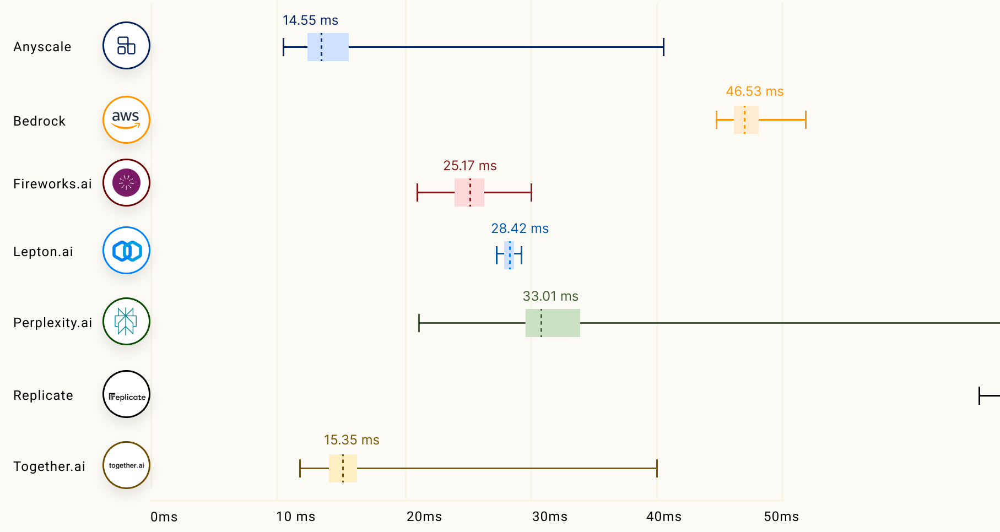
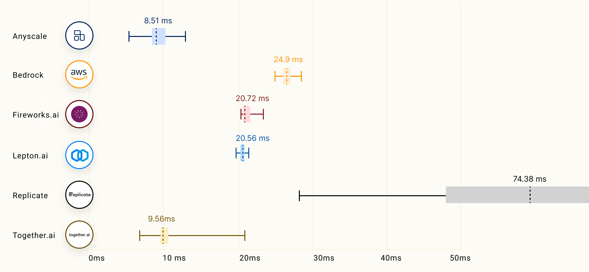
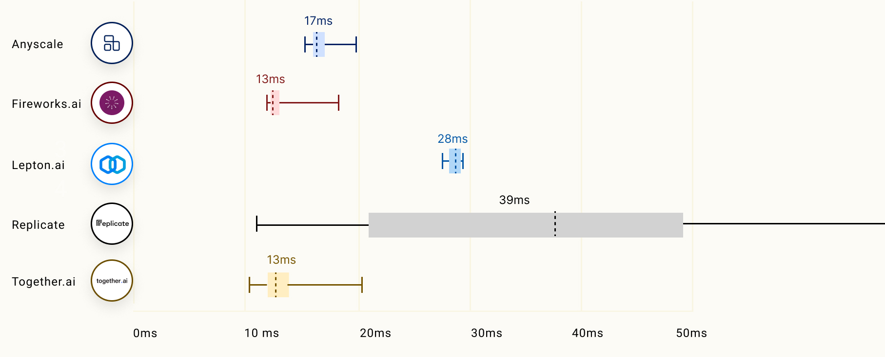

# LLMPerf Leaderboard :trophy:
Utilizing the [LLMPerf](https://github.com/ray-project/llmperf), we have benchmarked a selection of LLM inference providers.
Our analysis focuses on evaluating their performance, reliability, and efficiency under the following key metrics:
- Time to first token (TTFT), which represents the duration of time that LLM returns the first token. TTFT is especially important for streaming applications, such as chatbots. 
- Inter-token latency: The average time between consecutive tokens.

The LLMPerf Leaderboard displays results in a clear, transparent manner. Our aim is to provide users and developers with vital insights into the capabilities and limitations of each provider, informing decisions for future integrations and deployments. In line with our commitment to transparency and utility, we also provide reproducible steps in [Run Configurations](#run-configurations) as shown below:

#### Run Configurations

For each of the benchmark run, it is performed with the below command template from the [LLMPerf repository](https://github.com/ray-project/llmperf)

```
   python token_benchmark_ray.py \
    --model <MODEL_NAME> \
    --mean-input-tokens 550 \
    --stddev-input-tokens 0 \
    --mean-output-tokens 150 \
    --stddev-output-tokens 0 \
    --max-num-completed-requests 150 \
    --num-concurrent-requests 5 \
    --llm-api <litellm/openai> 
```

For each provider, we perform:
- Total number of requests:     150
- Concurrency:                  5 (5 concurrent requests to the provider)
- Prompt's token length:        550
- Expected output length:       150
- Tested models:                7B, 13B, and 70B of LLama-2 chat models


We ran the LLMPerf clients on an AWS EC2 (Instance type: i4i.large) from us-west-2 (Oregon) region. The results were up-to-date of December 19, 2023, 3am PST. You could find the detailed results in the [raw_data](raw_data) folder.

#### Caveats and Disclaimers

Note that there may be some possible source of biases or discrepancies from your perceived behavior:

- The endpoints provider backend might vary widely, so this is not a reflection on how the software runs on a particular hardware.
- The results may vary with time of day.
- The results (e.g. measurement of TTFT) depend on client location, and can also be biased by some providers lagging on the first token in order to increase ITL. Our current measurement location is from us-west (Oregon).
- The results is only a proxy of the system capabilities and is also impacted by the existing system load and provider traffic.
- The results may not correlate with users’ workloads.


### Time to First Token (seconds)

For streaming applications, the TTFT is how long before the LLM returns the first token.

####  70B Models


| Framework  | Model                                                                                                | Median  | Mean   | Min   | Max   | P25   | P75   | P95   | P99   |
|------------|------------------------------------------------------------------------------------------------------|---------|--------|-------|-------|-------|-------|-------|-------|
| anyscale   | meta-llama/Llama-2-70b-chat-hf                                                                      | 0.21    | 0.25   | 0.18  | 0.59  | 0.19  | 0.30  | 0.36  | 0.47  |
| bedrock     | meta.llama2-70b-chat-v1 |     0.39 |   0.41 |  0.29 |  0.72 |  0.37 |  0.41 |  0.54 |  0.69 |
| fireworks  | accounts/fireworks/models/llama-v2-70b-chat                                                          | 0.51    | 0.51   | 0.32  | 0.96  | 0.39  | 0.56  | 0.79  | 0.95  |
| lepton      | llama2-70b |     0.93 |    0.9 |  0.72 |  1.12 |  0.82 |  0.96 |  1.01 |   1.1 |
| perplexity | llama-2-70b-chat | 0.37 | 0.42 | 0.29 | 0.70 | 0.34 | 0.52 | 0.63 | 0.66 |
| replicate   | meta/llama-2-70b-chat |     1.19 |   5.08 |  0.97 | 71.57 |  1.03 |   1.7 | 24.23 | 63.63 |
| together   | together_ai/togethercomputer/llama-2-70b-chat                                                        | 0.63    | 0.62   | 0.46  | 0.89  | 0.55  | 0.67  | 0.77  | 0.87  |


#### 13B Models


| Framework  | Model                                           | Median    | Mean     | Min      | Max      | P25     | P75     | P95     | P99     |
|------------|-------------------------------------------------|-----------|----------|----------|----------|---------|---------|---------|---------|
| anyscale   | meta-llama/Llama-2-13b-chat-hf                  | 0.20      | 0.22     | 0.18     | 0.56     | 0.19    | 0.22    | 0.34    | 0.50    |
| bedrock     | meta.llama2-13b-chat-v1 |     0.27 |   0.33 |  0.16 |  0.77 |  0.25 |   0.3 |  0.74 |  0.76 |
| fireworks  | accounts/fireworks/models/llama-v2-13b-chat     | 0.49      | 0.47     | 0.28     | 0.66     | 0.39    | 0.54    | 0.59    | 0.65    |
| lepton      | llama2-13b |     1.08 |   1.07 |  0.82 |   1.4 |  0.95 |  1.15 |  1.24 |  1.37 |
| replicate   | meta/llama-2-13b-chat |     5.65 |   6.27 |  0.98 | 17.01 |  3.62 |  8.31 | 14.76 | 16.71 |
| together   | together_ai/togethercomputer/llama-2-13b-chat   | 0.54      | 0.89     | 0.39     | 0.91   | 0.46    | 0.60    | 0.70    | 0.81   |


> \* Perplexity doesn't offer 13B models when the data was gathered. More details for models offered could be found [here](https://docs.perplexity.ai/docs/model-cards).


#### 7B Models


| Framework | Model                                                          | Median | Mean   | Min       | Max        | P25       | P75       | P95       | P99       |
|-----------|----------------------------------------------------------------|--------|--------|-----------|------------|-----------|-----------|-----------|-----------|
| anyscale  | meta-llama/Llama-2-7b-chat-hf                                  | 0.20   | 0.23   | 0.18      | 0.50       | 0.19      | 0.23      | 0.34      | 0.46      |
| fireworks | accounts/fireworks/models/llama-v2-7b-chat                     | 0.33   | 0.33   | 0.21      | 1.09       | 0.32      | 0.34      | 0.37      | 0.88      |
| lepton      | llama2-7b |     1.13 |   1.11 |  0.88 |  1.33 |  1.04 |  1.18 |  1.29 |  1.32 |
| replicate   | meta/llama-2-7b-chat |     3.68 |   3.61 |  0.99 |   7.2 |  2.31 |  5.01 |  6.37 |  6.99 |
| together  | together_ai/togethercomputer/llama-2-7b-chat                   | 0.52   | 0.58   | 0.42      | 0.95       | 0.46      | 0.71      | 0.84      | 0.94      |


> \* Perplexity doesn't offer Llama-2-7B models when the data was gathered. More details for models offered could be found [here](https://docs.perplexity.ai/docs/model-cards).

> \* Bedrock doesn't offer Llama-2-7B models when the data was gathered. More details for models offered could be found [here](https://aws.amazon.com/bedrock/llama-2/).

### Inter Token Latency (ms)

Inter-token latency is measured as the average time between consecutive tokens in a LLM request excluding the time-to-first token. We collect results by sending 150 requests to each LLM inference provider, and calculate the mean ITL and percentiles based on 150 requests.


Note that the calculation of inter-token latency (ITL) doesn't include TTFT. In the context of a response with an output token length of N, the total end-to-end response time is equal to `TTFT + (N-1) * ITL`.

####  70B Models



| Framework  | Model                                               | Median | Mean | Min | Max  | P25 | P75 | P95 | P99 |
|------------|-----------------------------------------------------|--------|------|-----|------|-----|-----|-----|-----|
| anyscale   | meta-llama/Llama-2-70b-chat-hf                      | 15     | 16   | 11  | 43   | 13  | 17  | 23  | 39  |
| bedrock    | meta.llama2-70b-chat-v1                             | 46     | 47   | 45  | 54   | 46  | 47  | 52  | 54  |
| fireworks  | accounts/fireworks/models/llama-v2-70b-chat         | 25     | 25   | 22  | 30   | 24  | 26  | 28  | 30  |
| lepton     | llama2-70b                                          | 30     | 30   | 25  | 32   | 30  | 31  | 32  | 32  |
| perplexity | llama-2-70b-chat                                    | 33     | 34   | 23  | 112  | 32  | 35  | 38  | 41  |
| replicate  | meta/llama-2-70b-chat                               | 97     | 128  | 91  | 647  | 96  | 99  | 273 | 592 |
| together   | together_ai/togethercomputer/llama-2-70b-chat       | 15     | 16   | 13  | 40   | 15  | 16  | 19  | 23  |


####  13B Models



| Framework   | Model                                             | Median | Mean | Min | Max | P25 | P75 | P95 | P99 |
|-------------|---------------------------------------------------|--------|------|-----|-----|-----|-----|-----|-----|
| anyscale    | meta-llama/Llama-2-13b-chat-hf                    | 9      | 9    | 7   | 13  | 8   | 9   | 10  | 11  |
| bedrock     | meta.llama2-13b-chat-v1                           | 27     | 27   | 26  | 30  | 26  | 27  | 30  | 30  |
| fireworks   | accounts/fireworks/models/llama-v2-13b-chat       | 21     | 21   | 19  | 23  | 21  | 21  | 22  | 22  |
| lepton      | llama2-13b                                        | 23     | 23   | 21  | 27  | 23  | 24  | 25  | 26  |
| replicate   | meta/llama-2-13b-chat                             | 61     | 70   | 28  | 179 | 49  | 86  | 140 | 151 |
| together    | together_ai/togethercomputer/llama-2-13b-chat     | 10     | 18   | 8   | 23  | 9   | 10  | 12  | 20  |


#### 7B Models



| Framework | Model                                                    | Median | Mean | Min | Max  | P25 | P75 | P95 | P99 |
|-----------|----------------------------------------------------------|--------|------|-----|------|-----|-----|-----|-----|
| anyscale  | meta-llama/Llama-2-7b-chat-hf                            | 17     | 17   | 16  | 20   | 16  | 17  | 19  | 20  |
| fireworks | accounts/fireworks/models/llama-v2-7b-chat               | 13     | 13   | 12  | 19   | 13  | 13  | 14  | 17  |
| lepton    | llama2-7b                                                | 28     | 28   | 25  | 31   | 26  | 29  | 30  | 30  |
| replicate | meta/llama-2-7b-chat                                     | 39     | 44   | 13  | 576  | 24  | 50  | 61  | 189 |
| together  | together_ai/togethercomputer/llama-2-7b-chat             | 13     | 14   | 11  | 20   | 12  | 14  | 17  | 19  |


# Feedbacks

- Kindly provide your feedback using the [link](https://github.com/ray-project/llmperf-leaderboard/issues/new). We would love to hear from you.
 - For LLM inference service providers interested in having their API featured on this dashboard, please submit an issue or reach out to us via [email](mailto:endpoints-help@anyscale.com) for further communication (e.g. setting up of test accounts and etc).